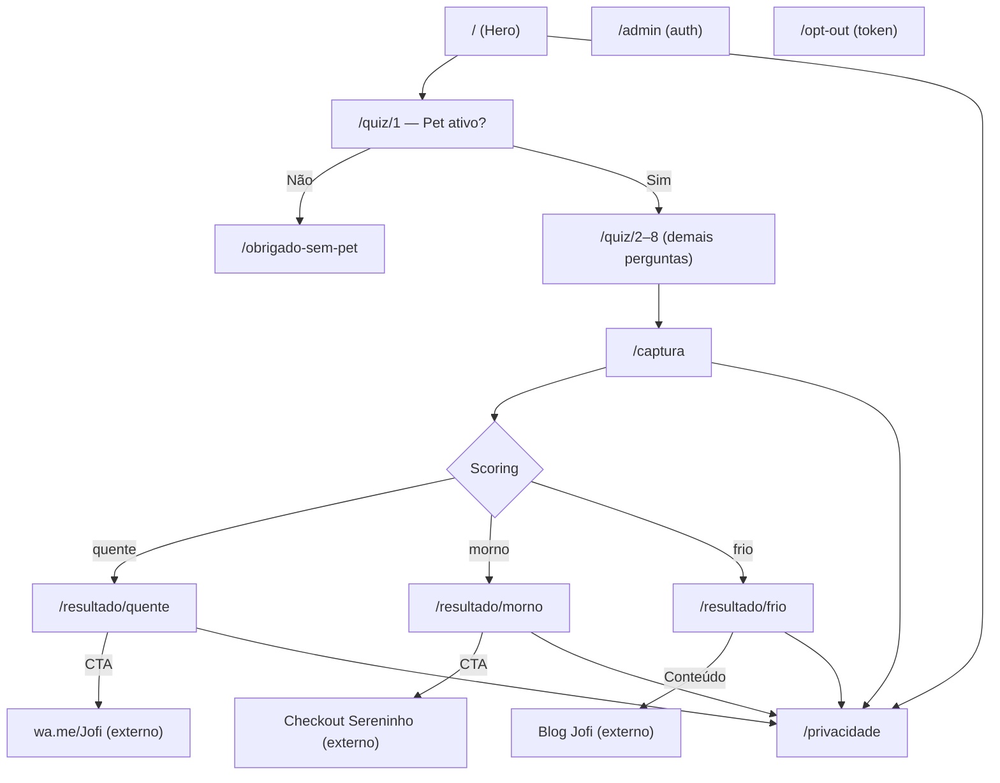
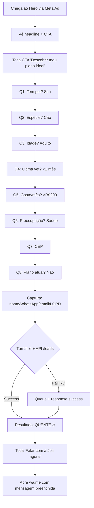
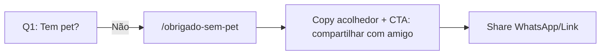
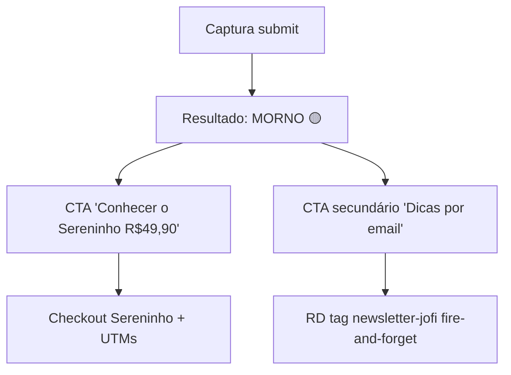
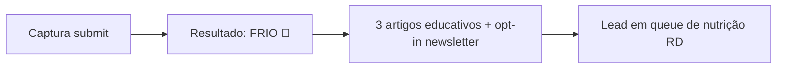

# Jofi Pet Quiz LP UI/UX Specification

**Status:** Draft v1.0
**Source:** [docs/brief.md](brief.md), [docs/prd.md](prd.md)
**Gerado por:** @ux-design-expert (via aiox-master), 2026-04-17
**Workflow:** greenfield-ui (Phase 3)

Este documento define os goals de UX, IA, user flows e especificações visuais para a **Jofi Pet Quiz LP**. Serve como base para design visual (DM) e desenvolvimento frontend. Paleta e tokens visuais marcados "⚠️ a alinhar com DM" devem ser confirmados antes do Epic 1 começar — não bloqueiam arquitetura.

---

## 1. Introduction

### 1.1 Overall UX Goals & Principles

#### Target User Personas

- **Tutor Preocupado (Primary):** 28–55 anos, classe B/C, cão/gato de 3–12 anos. Já gastou >R$500 em vet nos últimos 6 meses. Fricção alta com formulários longos. Alta ansiedade emocional com pet. Mobile-primário (Instagram Stories/Feed), Safari iOS ou Chrome Android.
- **Tutor de Primeira Viagem (Secondary):** 22–35 anos, pet <2 anos adotado recentemente. Pesquisador. Compara preços. Tolerância maior a conteúdo informativo mas precisa de confiança antes de dar dados.
- **Decisor Interno — Pedro (Admin):** Usa `/admin` em desktop para auditar leads. Baixa frequência (1x/semana).

#### Usability Goals

- **Tempo até primeira ação:** Hero → clique no CTA em ≤5s
- **Conclusão do quiz:** 90s–180s (mediana)
- **Taxa de completion:** ≥55% start→captura
- **Error recovery:** Mensagens inline, 0 modais bloqueantes; máx 1 retry por campo inválido
- **Memorabilidade:** Zero — é experiência de uma única sessão, sem recorrência
- **Confiança:** 100% dos usuários devem encontrar consent LGPD + link de privacidade antes do submit

#### Design Principles

1. **Acolhimento primeiro** — O tom Jofi ("tutores", linguagem leve, emojis pet) domina cada micro-copy. Nunca soar corporativo ou transacional.
2. **One thing at a time** — Uma pergunta por tela. Zero scroll no fluxo principal. Progress visível sempre.
3. **Diagnóstico como recompensa** — O tutor **recebe** antes de **dar**: captura acontece no fim, depois do investimento emocional no quiz.
4. **Mobile-first radical** — Desktop é adaptação, não protagonista. Hit areas ≥48px. Fonte base 16px. Polegar zone respeitada (CTAs no terço inferior).
5. **Feedback imediato** — Cada toque tem resposta visual <100ms (opacidade, escala, cor). Haptic curto quando suportado.

### 1.2 Change Log

| Date | Version | Description | Author |
|---|---|---|---|
| 2026-04-17 | 1.0 | Initial UX spec from brief + PRD | @ux-design-expert (aiox-master) |

---

## 2. Information Architecture (IA)

### 2.1 Site Map / Screen Inventory



### 2.2 Navigation Structure

- **Primary Navigation:** Inexistente por design. A LP é single-funnel; barra de navegação tradicional distrairia. Logo da Jofi no topo atua como "reset" (link para `/`).
- **Secondary Navigation:** Link "Política de privacidade" no footer de todas as telas + na tela de captura próximo ao checkbox LGPD.
- **Breadcrumb Strategy:** N/A. A progress bar do quiz cumpre o papel de orientação.
- **Back button:** Botão "Voltar" (ícone chevron) no canto superior esquerdo apenas nas telas de pergunta 2–8 e captura. Hero e resultado não têm voltar.

---

## 3. User Flows

### 3.1 Flow: Happy Path Completo (Quente)

**User Goal:** Receber diagnóstico e ser atendido pela Jofi.
**Entry Points:** Anúncio Meta Ads, link de indicação, tráfego direto.
**Success Criteria:** Clique no CTA WhatsApp do resultado + evento `Lead` no Meta Pixel.



**Edge Cases & Error Handling:**
- Rede cai durante quiz → state em sessionStorage preserva progresso ao reconectar
- Submit API falha (5xx) → mostra toast "Recebemos seu cadastro 🐾" e segue para resultado (lead vai para queue)
- Turnstile bloqueia → tela de fallback "parece que não é você mesmo, tenta de novo" com novo desafio visível
- WhatsApp Jofi indisponível no `wa.me` → CTA secundário "Nos ligar" com telefone

**Notes:** O salto de Q1=Não para `/obrigado-sem-pet` é o único ponto de fuga do quiz. Todos os demais caminhos convergem na captura.

### 3.2 Flow: Eliminação Graciosa (Sem Pet)

**User Goal:** Sair sem frustração.
**Entry Points:** Pergunta 1 do quiz.
**Success Criteria:** Usuário entende que não é público-alvo mas recebe valor (compartilhamento com amigo tutor).



**Edge Cases:**
- Usuário volta para Q1 → permite alterar resposta
- Clica share → preserva UTM original para indicação rastreada

### 3.3 Flow: Captura → Resultado Morno

**User Goal:** Descobrir plano de baixo ticket e converter para Sereninho.



**Edge Cases:**
- Checkout Sereninho fora do ar → fallback "em breve" + opt-in email
- Tutor clica newsletter sem ter passado LGPD → bloqueia e explica

### 3.4 Flow: Captura → Resultado Frio

**User Goal:** Receber conteúdo útil sem pressão.



**Edge Cases:**
- Tutor revela ser cliente Jofi atual → copy específico "Oi, tutor da casa 💛" + link para área do cliente

---

## 4. Wireframes & Mockups

**Primary Design Files:** _A criar em Figma pela equipe DM após aprovação deste spec._ Este documento traz wireframes low-fi ASCII + descrição detalhada de cada tela para orientar DM.

### 4.1 Key Screen Layouts

#### Screen 1 — Hero / Landing (`/`)

**Purpose:** Captar atenção em <3s, comunicar promessa de valor, iniciar quiz com 1 toque.

```
┌─────────────────────────────┐
│  [logo Jofi]                │ ← 48px altura, topo seguro
│                             │
│                             │
│    🐾                       │ ← ilustração pet centralizada
│                             │
│  Seu pet merece             │ ← H1, 32px, peso 800
│  o melhor cuidado.          │
│                             │
│  Responda 6 perguntas       │ ← body 16px, cinza 700
│  e descubra o plano         │
│  ideal para ele.            │
│                             │
│  ⭐ +[X] tutores já         │ ← selo social proof, small
│     descobriram             │
│                             │
│  ┌───────────────────────┐  │
│  │ Descobrir meu plano   │  │ ← CTA primary, 56px altura
│  │  ideal 🐾             │  │   cor coral, radius 28px
│  └───────────────────────┘  │
│                             │
│  ~90s para completar        │ ← small, cinza 500
│                             │
└─────────────────────────────┘
  [footer link privacidade]
```

**Key Elements:**
- Logo Jofi (link para `/`, 40×40px mínimo)
- Ilustração pet hero (PNG/SVG, ≤80KB, alt descritivo)
- Headline 2 linhas + subheadline 3 linhas
- Selo social proof (contador dinâmico ou estático MVP)
- CTA primário único de alto contraste, na zona do polegar
- Microcopy de expectativa ("~90s")
- Footer link para privacidade

**Interaction Notes:** Sem scroll no mobile padrão (ajustar para vh). Haptic leve no toque do CTA. Transição para `/quiz/1` com fade-out do hero + fade-in da pergunta (280ms).

#### Screen 2 — Tela de Pergunta (`/quiz/[n]`)

**Purpose:** Coletar uma resposta por vez com progress visível e navegação simples.

```
┌─────────────────────────────┐
│  ←           [3 de 8]       │ ← back + counter, 44px
│  ━━━━━━━━━━░░░░░░░░░░       │ ← progress bar animada
│                             │
│                             │
│  🐶                         │ ← emoji/ilustração contextual
│                             │
│  Qual a idade                │ ← H2, 24px, peso 700
│  do seu pet?                │
│                             │
│  ┌───────────────────────┐  │
│  │ 🐣 Filhote (até 1 ano)│  │ ← opção, 56px
│  └───────────────────────┘  │
│  ┌───────────────────────┐  │
│  │ 🐕 Adulto (1-7 anos)  │  │
│  └───────────────────────┘  │
│  ┌───────────────────────┐  │
│  │ 👴 Idoso (7+ anos)    │  │
│  └───────────────────────┘  │
│                             │
│                             │
│                             │ ← safe area bottom
└─────────────────────────────┘
```

**Key Elements:**
- Header fino: botão voltar (esquerda) + contador "N de M" (direita) + progress bar abaixo
- Emoji/ilustração contextual grande
- Pergunta em H2
- Opções em cards tocáveis (56px altura, radius 16px, borda 1px neutral)
- Auto-advance 200ms após seleção (single-choice) ou botão "Próxima" flutuante (multi/scale)
- Barra inferior só aparece em multi-choice com CTA "Próxima (N selecionadas)"

**Interaction Notes:**
- Tap em opção: flash coral 120ms → checkmark 80ms → transição 280ms para próxima pergunta
- Haptic curto (haptic-feedback-light) se suportado
- Back button: preserva respostas, anima slide-right
- Suporte swipe-back na borda esquerda (opcional, iOS native-like)

#### Screen 2b — Pergunta tipo Scale

```
│  Quanto você gasta por mês  │
│  com seu pet hoje?          │
│                             │
│    R$0 ─────●───── R$500+   │ ← slider + labels dinâmicos
│        R$ 180/mês           │ ← valor selecionado, live
│                             │
│  ┌───────────────────────┐  │
│  │ Próxima →             │  │
│  └───────────────────────┘  │
```

#### Screen 2c — Pergunta tipo Input (CEP)

```
│  Qual seu CEP?              │
│  (pra ver vets perto)       │ ← hint abaixo
│                             │
│  ┌───────────────────────┐  │
│  │ 00000-000             │  │ ← input mask numérica, 56px
│  └───────────────────────┘  │
│                             │
│  ┌───────────────────────┐  │
│  │ Próxima →             │  │ ← desabilita até 8 dígitos
│  └───────────────────────┘  │
│                             │
│  [Pular essa pergunta]      │ ← link ghost, small
```

#### Screen 3 — Captura (`/captura`)

**Purpose:** Coletar contato com mínimo friction mantendo conformidade LGPD.

```
┌─────────────────────────────┐
│  ←           [9 de 9]       │
│  ━━━━━━━━━━━━━━━━━━━━       │ ← progress completa
│                             │
│  Quase lá! 🎉               │ ← H2
│                             │
│  Deixa a gente te enviar    │ ← body
│  seu resultado personalizado│
│                             │
│  Nome                       │ ← label, 14px
│  ┌───────────────────────┐  │
│  │ Como te chamamos?     │  │ ← placeholder acolhedor
│  └───────────────────────┘  │
│                             │
│  WhatsApp                   │
│  ┌───────────────────────┐  │
│  │ (XX) XXXXX-XXXX       │  │ ← máscara BR
│  └───────────────────────┘  │
│                             │
│  Email (opcional)           │
│  ┌───────────────────────┐  │
│  │ seu@email.com         │  │
│  └───────────────────────┘  │
│                             │
│  ☐ Concordo em receber      │ ← checkbox LGPD
│    contato da Jofi. Veja    │   texto com link
│    [política de privacidade]│
│                             │
│  ┌───────────────────────┐  │
│  │ Ver meu resultado 🐾  │  │ ← CTA primary
│  └───────────────────────┘  │
│                             │
│  🔒 Seus dados estão        │ ← reassurance
│    seguros com a gente      │
└─────────────────────────────┘
```

**Key Elements:**
- Headline acolhedora anti-ansiedade ("Quase lá!")
- 3 campos (nome, WhatsApp, email opcional) com labels flutuantes
- Checkbox LGPD não pré-marcado + link política
- CTA desabilitado (opacity 40%) até validação passar
- Reassurance de segurança no bottom
- Turnstile invisível (sem UI se passar; modal de desafio se falhar)

**Interaction Notes:**
- Validação onBlur (não onChange) para reduzir ansiedade
- Mensagens de erro em cor warning abaixo do campo, tom acolhedor ("Ops, o WhatsApp parece incompleto 🐾")
- Focus ring visível 3px azul claro
- iOS: keyboard `type="tel"` para WhatsApp, `type="email"` para email

#### Screen 4 — Resultado Quente (`/resultado/quente`)

```
┌─────────────────────────────┐
│                             │
│         🔥                  │ ← ilustração tier quente
│                             │
│  {Nome}, seu {pet_species}  │ ← H1 personalizado
│  precisa de atenção!        │
│                             │
│  📋 Seu diagnóstico:        │
│                             │
│  • Pet adulto com rotina    │
│    vet ativa — risco alto   │
│    de imprevisto financeiro │
│                             │
│  • Sem plano atual —        │
│    cada visita é avulsa     │
│                             │
│  • Você está na cobertura   │
│    da nossa rede ❤️         │
│                             │
│  A Jofi pode te ajudar      │ ← copy de urgência
│  hoje mesmo.                │
│                             │
│  ┌───────────────────────┐  │
│  │ Falar com a Jofi      │  │ ← CTA WhatsApp
│  │   agora 💬            │  │   cor verde whatsapp
│  └───────────────────────┘  │
│                             │
│  [voltar ao início]         │ ← link ghost
└─────────────────────────────┘
```

**Interaction Notes:** CTA abre `wa.me` em nova aba. Tela permanece com copy de "te esperamos na conversa 🐾". Evento `Lead` + `InitiateCheckout` Meta.

#### Screen 5 — Resultado Morno (`/resultado/morno`)

```
│         🟡                  │ ← ilustração tier morno
│  {Nome}, tem uma forma      │
│  econômica de começar       │
│                             │
│  📋 Seu diagnóstico:        │
│  • {diagnóstico bullet 1}   │
│  • {diagnóstico bullet 2}   │
│  • {diagnóstico bullet 3}   │
│                             │
│  ⭐ Sereninho — R$49,90/mês │ ← box destacado
│  ┌───────────────────────┐  │
│  │ ✓ Consulta incluída   │  │
│  │ ✓ Desconto em exames  │  │
│  │ ✓ Rede credenciada    │  │
│  └───────────────────────┘  │
│                             │
│  ┌───────────────────────┐  │
│  │ Assinar Sereninho     │  │ ← CTA primary
│  │   por R$49,90 →       │  │
│  └───────────────────────┘  │
│                             │
│  [ou receba dicas grátis    │ ← secondary CTA
│   por email]                │
```

#### Screen 6 — Resultado Frio (`/resultado/frio`)

```
│         🔵                  │
│  Obrigada por responder,    │
│  {Nome}! 💛                 │
│                             │
│  Separamos 3 conteúdos      │
│  pra você e seu pet:        │
│                             │
│  ┌───────────────────────┐  │
│  │ 📖 5 sinais que seu   │  │ ← artigo card
│  │    pet precisa de vet │  │   tap → blog
│  └───────────────────────┘  │
│  ┌───────────────────────┐  │
│  │ 🍽️ O que evitar na    │  │
│  │    alimentação        │  │
│  └───────────────────────┘  │
│  ┌───────────────────────┐  │
│  │ 🎾 Brincadeiras seguras│ │
│  │    pro seu pet        │  │
│  └───────────────────────┘  │
│                             │
│  ┌───────────────────────┐  │
│  │ Receber dicas por     │  │ ← secondary CTA newsletter
│  │   email 💌            │  │
│  └───────────────────────┘  │
```

#### Screen 7 — Obrigado Sem Pet (`/obrigado-sem-pet`)

```
│         🌟                  │
│  Poxa, a Jofi é pra         │
│  quem tem pet. 🐾           │
│                             │
│  Mas quem sabe você não     │
│  conhece alguém que         │
│  curtiria saber disso?      │
│                             │
│  ┌───────────────────────┐  │
│  │ Compartilhar          │  │ ← navigator.share API
│  │   com um amigo 💛     │  │
│  └───────────────────────┘  │
│                             │
│  [voltar ao início]         │
```

#### Screen 8 — Política de Privacidade (`/privacidade`)

Layout padrão de página longform com heading, cláusulas LGPD, botão de opt-out, contato DPO. Desktop-friendly. Link footer de toda LP.

#### Screen 9 — Admin (`/admin`)

Layout tabular desktop-first, basic auth no topo. Filtro tier, busca nome, botão reenviar RD.

---

## 5. Component Library / Design System

**Design System Approach:** Usar **shadcn/ui** como base (copy-paste, Tailwind, acessível por padrão) e customizar tokens no `tailwind.config.ts` para refletir identidade Jofi. Componentes do quiz são custom (não existem em shadcn).

### 5.1 Core Components

#### Button
- **Purpose:** Ação primária ou secundária em qualquer tela.
- **Variants:** `primary` (coral preenchido), `secondary` (outline neutral), `ghost` (texto + underline no hover), `whatsapp` (verde #25D366)
- **States:** default, hover, active, disabled (opacity 40% + cursor not-allowed), loading (spinner 16px + texto fade)
- **Usage Guidelines:** Um único botão primário por tela. Altura mínima 56px no mobile (44px em desktop). Full-width em telas de quiz/captura/resultado.

#### QuizOption
- **Purpose:** Card tocável de opção de resposta (single/multi choice).
- **Variants:** `default`, `selected` (borda coral + bg coral-50), `disabled`
- **States:** idle, hover (elevação 2px), pressed (scale 0.98), selected
- **Usage Guidelines:** Altura fixa 56px, radius 16px, ícone/emoji opcional à esquerda, texto à direita. Tap area vai até as bordas (não só o texto).

#### ProgressBar
- **Purpose:** Mostrar progresso do quiz.
- **Variants:** Única — linear horizontal.
- **States:** animated (preenchimento com ease-out 400ms ao avançar)
- **Usage Guidelines:** Altura 4px, bg neutral-200, preenchimento coral. Sempre abaixo do header; largura 100% menos padding horizontal (16px cada lado).

#### Input (Text/Tel/Email)
- **Purpose:** Coletar texto do usuário.
- **Variants:** `text`, `tel` (máscara BR WhatsApp), `email`, `cep` (máscara)
- **States:** empty, filled, focused (ring azul 3px), error (borda warning + ícone + mensagem abaixo), success (checkmark verde)
- **Usage Guidelines:** Label flutuante acima, placeholder gentil, altura 56px, font 16px (evita zoom iOS).

#### Checkbox (LGPD)
- **Purpose:** Consent explícito.
- **Variants:** Única — square check 24×24, label à direita.
- **States:** unchecked, checked, focused, error
- **Usage Guidelines:** Nunca pré-marcado. Label clicável. Link dentro do label em sublinhado.

#### Toast
- **Purpose:** Feedback não-bloqueante pós-ação.
- **Variants:** `info`, `success`, `error`
- **States:** enter (slide-up 200ms), visible (4s padrão), exit (fade 150ms)
- **Usage Guidelines:** Bottom-center no mobile, top-right no desktop. Não bloqueia interação. Máximo 1 visível.

#### Card (Resultado/Artigo)
- **Purpose:** Container de conteúdo no resultado frio e destaque Sereninho.
- **Variants:** `result-bullet`, `article`, `product-highlight`
- **States:** idle, pressed (artigo), (sem interação em bullets)
- **Usage Guidelines:** Radius 16px, padding 16px, shadow sutil (nenhuma em mobile para preservar LCP).

#### Modal (Turnstile fallback)
- **Purpose:** Desafio de captcha quando invisível falha.
- **Variants:** Única.
- **States:** opening, open, closing
- **Usage Guidelines:** Raro. Focus trap obrigatório. Esc fecha. Dismissível mas bloqueia submit até resolver.

---

## 6. Branding & Style Guide

**Brand Guidelines:** _Paleta e tipografia abaixo são **propostas iniciais** — ⚠️ a alinhar com David Miranda (DM) antes do Epic 1. Basear no manual de marca atual da Jofi (buscar em pasta da agência) ou, se inexistente, formalizar a partir dos padrões já usados no Instagram e nas artes de campanha._

### 6.1 Visual Identity

Identidade Jofi deve projetar: **acolhimento · confiabilidade · alegria pet · simplicidade**. Afastar de: hospital veterinário frio, tecnologia dura, corporativo.

### 6.2 Color Palette (Proposta — confirmar com DM)

| Color Type | Hex (proposta) | Usage |
|---|---|---|
| Primary (Coral Jofi) | `#FF7A59` | CTAs primários, highlights de progresso, tier quente |
| Secondary (Cream) | `#FFF7F0` | Backgrounds de tela, cards |
| Accent (Amarelo Warm) | `#FFD66B` | Tier morno, destaques pontuais, ilustrações |
| Success (Verde Pet) | `#4CAF82` | Checkmarks, tier frio (confiança), confirmações |
| Warning (Âmbar) | `#FFA83D` | Avisos, tier morno alternativo |
| Error (Coral Escuro) | `#E3594A` | Erros de validação, estados destrutivos |
| Neutral 900 | `#2D2520` | Texto principal (warm black, não preto puro) |
| Neutral 700 | `#5C524C` | Texto secundário |
| Neutral 500 | `#8D847E` | Texto terciário, hints |
| Neutral 300 | `#DDD4CE` | Bordas, dividers |
| Neutral 100 | `#F6F2EE` | Backgrounds secundários |
| WhatsApp | `#25D366` | CTA resultado quente (conformidade visual) |

Contraste mínimo 4.5:1 validado: `#2D2520` sobre `#FFF7F0` = 13.8:1 ✅; `#FFFFFF` sobre `#FF7A59` = 3.2:1 (usar apenas em texto ≥18px ou bold 14px+).

### 6.3 Typography

#### Font Families (Proposta)

- **Primary:** `Nunito` (arredondada, friendly, excelente PT-BR com acentuação) — fallback `system-ui`
- **Secondary:** `Nunito` (mesma family, apenas variações de peso)
- **Monospace:** N/A no projeto

Hospedar via `next/font/google` (self-hosted, zero FOIT/FOUT, bundle subset latin-ext).

#### Type Scale (mobile base)

| Element | Size | Weight | Line Height |
|---|---|---|---|
| H1 | 32px | 800 | 1.2 |
| H2 | 24px | 700 | 1.3 |
| H3 | 20px | 700 | 1.4 |
| Body | 16px | 400 | 1.5 |
| Body-strong | 16px | 600 | 1.5 |
| Small | 14px | 400 | 1.4 |
| Label | 14px | 600 | 1.3 |
| Caption | 12px | 400 | 1.4 |

Desktop escala +10% via `clamp()` em `html { font-size }`.

### 6.4 Iconography

**Icon Library:** `lucide-react` (padrão shadcn) para ícones funcionais (back, search, check, alert, eye). **Emojis nativos** para personalidade Jofi (🐾 🐶 🐱 💛 🔥 🟡 🔔). Ilustrações spot (pet, tutor, cenários) produzidas por DM em SVG inline (≤15KB cada).

**Usage Guidelines:**
- Ícones funcionais: 20–24px, cor `Neutral 700`
- Emojis: tamanho do texto + 4px
- Ilustrações: até 160×160px no mobile, sempre com `alt` descritivo

### 6.5 Spacing & Layout

**Grid System:** 4px base unit. Tailwind default `space-*` (multiplica por 0.25rem = 4px). Container mobile: `max-w-[420px]` centralizado com padding horizontal 16px. Desktop: `max-w-[600px]` com padding 24px.

**Spacing Scale:** `4, 8, 12, 16, 20, 24, 32, 40, 48, 64, 80, 96` (todos em px). Evitar valores ímpares.

**Safe Areas:** Respeitar `env(safe-area-inset-*)` no iOS (notch + home indicator). Top 48px mínimo, bottom 32px mínimo em CTAs.

---

## 7. Accessibility Requirements

### 7.1 Compliance Target

**Standard:** WCAG 2.1 nível AA (meta realista para MVP). Mirar AAA em contraste onde viável.

### 7.2 Key Requirements

**Visual:**
- Contraste ratios: 4.5:1 (texto regular), 3:1 (texto grande ≥18px ou bold ≥14px), 3:1 (componentes UI)
- Focus indicators: ring azul claro 3px `#4A90E2`, offset 2px, sempre visível (nunca `outline: none` sem substituto)
- Text sizing: Usuário pode dar zoom até 200% sem quebrar layout; usar `rem` para todos os tamanhos

**Interaction:**
- Keyboard navigation: Tab linear, Enter aciona CTAs, Esc fecha modais, setas em listas de opções single-choice (opcional)
- Screen reader: Progress bar com `aria-valuenow`/`aria-valuemax`; perguntas com `role="radiogroup"` + `aria-labelledby`; toast com `role="status"` + `aria-live="polite"`; erros com `role="alert"`
- Touch targets: mínimo 48×48px (iOS HIG) / 44×44px (WCAG); espaçamento ≥8px entre targets adjacentes

**Content:**
- Alternative text: Toda ilustração/emoji com `alt` ou `aria-label` descritivo; decorativos com `alt=""`
- Heading structure: Uma H1 por tela, hierarquia linear sem pular níveis
- Form labels: `<label>` associada via `for`+`id`, visível (não só placeholder); mensagens de erro programaticamente associadas via `aria-describedby`

### 7.3 Testing Strategy

- Lint: `eslint-plugin-jsx-a11y` no pre-commit
- Automated: `axe-core` via `@axe-core/react` em dev; Lighthouse CI gate ≥95 em todo PR
- Manual: Teste com VoiceOver (iOS Safari) e TalkBack (Android Chrome) em 3 fluxos principais antes de ship
- Matrix: Teclado-only + screen reader + zoom 200% em cada resultado antes do merge do epic

---

## 8. Responsiveness Strategy

### 8.1 Breakpoints

| Breakpoint | Min Width | Max Width | Target Devices |
|---|---|---|---|
| Mobile | 320px | 767px | iPhone SE → iPhone 15 Pro Max, Android médios |
| Tablet | 768px | 1023px | iPad Mini, iPad, Android tablets |
| Desktop | 1024px | 1439px | Notebooks, monitores HD |
| Wide | 1440px | — | Monitores 2K/4K |

### 8.2 Adaptation Patterns

- **Layout Changes:** Mobile = single column, max 420px de conteúdo centralizado; tablet/desktop = mesmo conteúdo centralizado em 600px com mais breathing room; wide não aumenta conteúdo (preserva foco).
- **Navigation Changes:** N/A — a LP não tem nav tradicional. Progress bar permanece idêntica em todos os breakpoints.
- **Content Priority:** Zero diferença de conteúdo por breakpoint. Desktop ganha apenas padding maior e hover states adicionais.
- **Interaction Changes:** Mobile = tap/swipe; desktop adiciona hover states e cursor pointer; keyboard navigation obrigatória em todos.

---

## 9. Animation & Micro-interactions

### 9.1 Motion Principles

1. **Motion = feedback, não decoração** — Cada animação confirma uma ação ou guia atenção.
2. **Rápido e reversível** — Nunca >400ms. Easing natural (`cubic-bezier(0.4, 0, 0.2, 1)` para entradas; `cubic-bezier(0.4, 0, 1, 1)` para saídas).
3. **Respeitar `prefers-reduced-motion`** — Substituir por fade sem translate.
4. **Performance first** — Animar apenas `transform` e `opacity`. Nunca `width/height/top/left`.

### 9.2 Key Animations

- **Transição entre perguntas:** Fade-out + slide-left (outgoing) | fade-in + slide-right (incoming) (Duration: 280ms, Easing: ease-out)
- **Seleção de opção:** Scale 0.98 → 1 + flash coral no border (Duration: 150ms, Easing: ease-out)
- **Progress bar fill:** Width/transform interpolation (Duration: 400ms, Easing: ease-out)
- **CTA hover (desktop):** Elevação 2px + brightness +5% (Duration: 120ms, Easing: ease)
- **CTA press (mobile):** Scale 0.97 (Duration: 80ms, Easing: ease-in)
- **Toast enter:** Slide-up + fade (Duration: 200ms, Easing: ease-out)
- **Toast exit:** Fade (Duration: 150ms, Easing: ease-in)
- **Hero → Quiz transition:** Cross-fade 320ms (Duration: 320ms, Easing: ease-in-out)
- **Resultado reveal:** Stagger dos 3 bullets com 80ms de delay entre cada (Duration: 300ms por item, Easing: ease-out)
- **Error shake:** Horizontal ±6px, 3 ciclos (Duration: 360ms, Easing: ease-in-out)
- **Haptic feedback:** Leve no tap de opção; médio no submit da captura (quando `navigator.vibrate` disponível)

---

## 10. Performance Considerations

### 10.1 Performance Goals

- **Page Load:** LCP <2s em 4G 3G-rated; TTI <3s; FCP <1.2s
- **Interaction Response:** INP <200ms (todas interações principais)
- **Animation FPS:** 60fps constante; zero jank em transições

### 10.2 Design Strategies

- Hero: 1 ilustração ≤40KB (AVIF com fallback WebP) + zero fontes externas fora do `next/font`
- Quiz: code-split por rota App Router; config JSON pré-carregado no entry da rota `/`
- Imagens: `next/image` com blur placeholder para ilustrações do resultado
- Fontes: `font-display: swap`, subset latin-ext apenas
- JS bundle: ≤150KB gzipped na rota quiz (crítico); Framer Motion importado apenas nos componentes que animam (dynamic import)
- Sem bibliotecas de estado externas (Zustand ou similar) — React useState/useReducer basta
- Prefetch da próxima rota do quiz via `router.prefetch` ao hover/touch-start do CTA

---

## 11. Next Steps

### 11.1 Immediate Actions

1. Pedro + DM: confirmar paleta e tipografia em sessão de 30min
2. DM: criar Figma com high-fidelity das 9 telas baseado nestes wireframes (2 dias)
3. Paulo Portella (PP): revisar e ajustar todas as copies (hero, perguntas, microcopy, resultados) — fornecer texto final para `config/content.json`
4. Handoff para @architect gerar `docs/architecture.md` em paralelo (não bloqueia Figma)
5. @po: validar UX spec + PRD contra po-master-checklist
6. Após paleta confirmada: atualizar este doc v1.1 + merge para main

### 11.2 Design Handoff Checklist

- [x] All user flows documented
- [x] Component inventory complete
- [x] Accessibility requirements defined
- [x] Responsive strategy clear
- [ ] Brand guidelines incorporated (⚠️ paleta a confirmar com DM)
- [x] Performance goals established

---

## 12. Checklist Results

_Pendente:_ executar checklist de UI/UX (se disponível em `.aiox-core/development/checklists/`) após DM confirmar paleta. Populado antes do handoff final para @dev.
